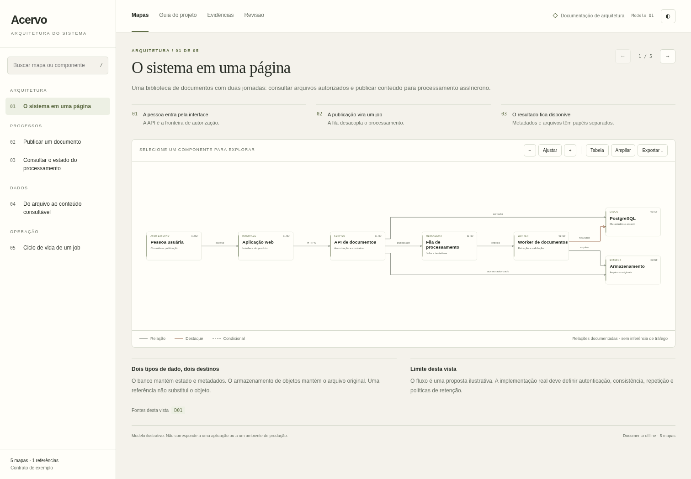
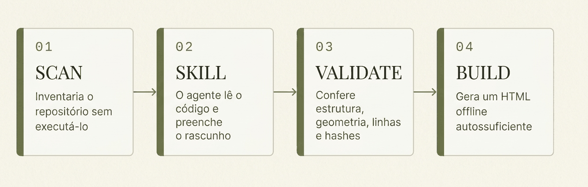
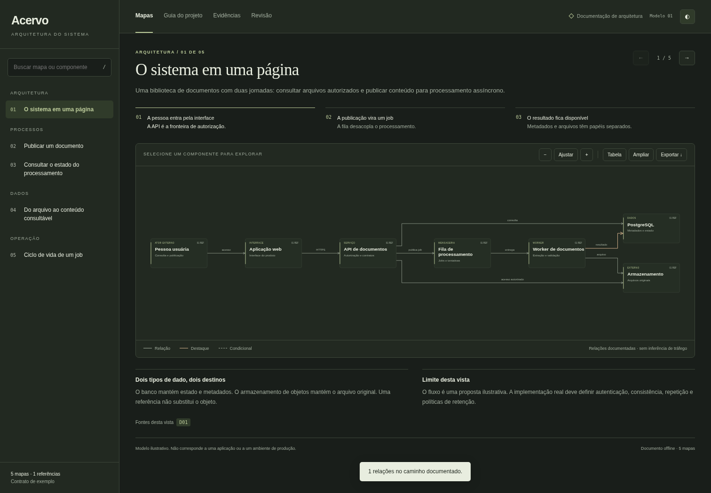
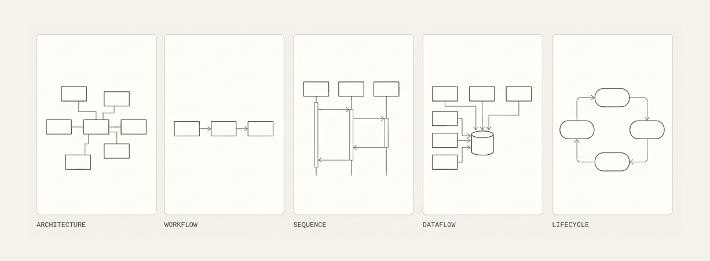

<div align="center">

# Estrato

**Documentação de arquitetura em um HTML autossuficiente.**

Mapas interativos, jornadas, guia técnico e evidências de código,
com identidade visual sóbria e sem marca do gerador no documento final.

[](LICENSE)
[](https://nodejs.org)
[](package.json)
[](#a-documentação-entregue)

</div>



<div align="center"><sub>Prévia real do exemplo fictício <b>Acervo</b>, tema <code>paper</code>.</sub></div>

---

## In English

**Estrato turns a codebase into one self-contained HTML file: interactive architecture maps, guided journeys, a technical guide and code-level evidence, with no generator branding in the final document.**

Requires **Node.js 20 or later**. No runtime dependencies, no Graphviz, no remote service, no API key, no frontend build.

```bash
npm install -g .
estrato doctor
estrato build examples/plataforma.json --out demo
```

Open `demo/index.html` in a browser. The bundled `Acervo` example is fictional and covers all five map types.

How it works, in four steps:

1. `estrato scan <repo>` inventories the repository **without executing it**, producing a structural draft.
2. `estrato skill install` drops an agent skill into the workspace so an AI agent can read the code and fill in the draft: journeys, chapters, and evidence.
3. `estrato validate --repo <repo>` checks structure, geometry, line ranges and SHA-256 hashes of every cited source file.
4. `estrato build` renders a single offline HTML document plus SVG diagrams, a Markdown guide and a verification receipt.

What it deliberately does not do: it never runs your project, never calls a network service, and never asserts that a claim is semantically true. Evidence references pin *where* and *which version* a statement came from; judging whether the statement follows from the code is a human review step.

Five map types are supported: `architecture`, `workflow`, `sequence`, `dataflow` and `lifecycle`. Three themes ship in the box: `paper`, `limestone` and `graphite`.

**The CLI messages, the viewer chrome and the documentation below are in Brazilian Portuguese.** Every authored field of the JSON source (titles, summaries, descriptions, chapters, notes) may be written in any language, so a generated document can read entirely in English. The `project.language` field itself is the one exception: this version validates it as `pt-BR` and rejects any other value.

Licensed under MIT. The package is **not** published to npm: do not assume `npx @flaviomartil/estrato` resolves.

---

## Começar

Requisito: **Node.js 20 ou superior**. Não requer dependências de runtime, Graphviz, serviço remoto, chave de API ou build de frontend.

A partir deste repositório extraído:

```bash
npm install -g .
estrato doctor
estrato build examples/plataforma.json --out demo
```

Abra `demo/index.html` no navegador. O exemplo Acervo é fictício e contém cinco tipos de mapa. Para rodar sem instalação global:

```bash
node bin/estrato.mjs build examples/plataforma.json --out demo --force
```

O pacote também pode ser instalado pelo arquivo `.tgz` da entrega:

```bash
npm install -g ./flaviomartil-estrato-0.1.0.tgz
```

**O pacote não foi publicado no npm.** Não use `npx @flaviomartil/estrato` presumindo que ele exista no registro.

## Documentar um repositório real



<div align="center"><sub>O fluxo em quatro etapas. Esquema ilustrativo, não é captura de tela.</sub></div>

```bash
# 1. Inventariar sem executar o projeto
estrato scan /caminho/do/projeto --out .estrato

# 2. Instalar a skill no workspace do agente
estrato skill install --agent codex --project /caminho/do/projeto

# 3. Pedir ao agente a leitura e o preenchimento de .estrato/project.json
# Veja o prompt logo abaixo.

# 4. Conferir estrutura, geometria, linhas e hashes
estrato validate .estrato/project.json --repo /caminho/do/projeto --json

# 5. Gerar a documentação
estrato build .estrato/project.json --repo /caminho/do/projeto --out docs/architecture

# 6. Conferir a integridade do pacote gerado
estrato check docs/architecture --json
```

Peça ao agente:

> Use a skill Estrato para entender este repositório. Leia o inventário em `.estrato`, siga as jornadas no código e complete `project.json` com mapas, guia técnico e evidências. Separe implementação observada, inferências e propostas. Gere a documentação, inspecione cada vista no navegador e não inclua marca do gerador no resultado. Não execute serviços, migrações ou comandos de produção.

A etapa 3 é importante: **o scanner sozinho não explica as regras de negócio**. Ele reconhece arquivos, manifests, blocos Compose simples e candidatos sintáticos de rotas. A interpretação é feita pelo agente ou por uma pessoa revisora. Dependências instaladas não viram serviços automaticamente. As relações `depends_on` representam ordem de inicialização, não tráfego de rede.

A skill também pode ser instalada com `--agent claude`, `--agent cursor` ou `--agent portable`. Para instalação no diretório pessoal, use `--global` em vez de `--project`. O instalador copia a skill, mas não instala nem autentica agentes de terceiros. O executável `estrato` precisa estar disponível no PATH do agente.

## A documentação entregue

```text
architecture/
├── index.html           # Atlas completo, funciona offline
├── architecture.json    # Fonte editável, sem marca do gerador
├── GUIA.md              # Guia e roteiro dos mapas
├── EVIDENCIAS.md         # Arquivos, linhas, hashes e trechos opcionais
├── LEIA-ME.txt           # Instruções para a pessoa leitora
├── verificacao.json     # Recibo e hashes dos artefatos
└── diagramas/           # SVG de cada vista
```

A interface inclui busca por mapa e componente, leitura guiada, detalhes dos nós, referências, alcance dirigido a montante/jusante, caminho entre dois componentes, zoom, tela cheia, modo tabela e tema alternável. As exportações do navegador incluem SVG, PNG, JSON e Markdown. A impressão reúne mapas, guia, evidências e revisão; salvar como PDF depende da impressão do navegador e não é uma exportação PDF nativa do CLI.

A navegação e os dados ficam no próprio HTML. Não há CDN, Google Fonts, chamadas de IA, analytics, telemetria ou verificação automática de atualização. As conexões externas são bloqueadas por uma política de conteúdo. Links autorais HTTPS podem abrir outra página por decisão da pessoa leitora.

A fonte tipográfica é de sistema. Os temas são **paper**, **limestone** e **graphite**: papel, pedra e carvão, com acentos discretos de oliva e verde.

```bash
estrato build project.json --theme graphite --out docs/architecture --force
```



<div align="center"><sub>O mesmo documento no tema <code>graphite</code>.</sub></div>

## Tipos de mapa



<div align="center"><sub>Os cinco tipos de mapa. Esquema ilustrativo, não é captura de tela.</sub></div>

| Tipo | Uso |
|---|---|
| `architecture` | Componentes, dependências e limites explícitos |
| `workflow` | Etapas, ramificações e resultados |
| `sequence` | Participantes, linhas de vida e mensagens em ordem |
| `dataflow` | Fontes, transformações e destinos de dados |
| `lifecycle` | Estados, transições e repetição |

Workflow e dataflow usam o motor de grafos comum, não um interpretador BPMN/UML. Lifecycle usa nós arredondados; sequence tem layout próprio de participantes e mensagens. As relações precisam estar na fonte: o visualizador não inventa topologia para completar uma história.

## Comandos

| Comando | Responsabilidade |
|---|---|
| `init [arquivo]` | Cria um projeto mínimo, marcado como rascunho |
| `scan <pasta>` | Cria inventário, roteiro de leitura e rascunho estrutural |
| `validate <arquivo>` | Confere estrutura e layout; com `--repo`, verifica arquivos, linhas e hashes |
| `build <arquivo>` | Gera o atlas completo em uma pasta dedicada |
| `render <arquivo>` | Alias de `build` |
| `check <pasta>` | Confere os hashes dos artefatos contra o recibo |
| `import <arquivo>` | Converte o subconjunto de arquitetura v1 do formato de referência |
| `diff <antes> <depois>` | Compara os documentos por IDs e campos, com recibo JSON |
| `dev <arquivo>` | Prévia local com atualização e preservação da última versão válida |
| `serve <index.html>` | Serve somente o HTML selecionado em loopback |
| `skill print` | Mostra as instruções da skill |
| `skill install` | Instala a skill no destino escolhido |
| `doctor` | Verifica Node e arquivos essenciais do pacote |

Execute `estrato --help` para a sintaxe completa. `--json` retorna recibos estruturados; falhas terminam com código 2. `--strict` trata avisos como falhas. `--force` atualiza somente uma saída gerenciada ou o arquivo explicitamente selecionado; não permite apagar uma pasta arbitrária não vazia.

## Prévia e atualização

```bash
estrato dev project.json --port 4173
estrato diff before.json after.json --out delta.json
```

A prévia escuta em `127.0.0.1`, não na rede local. JSON incompleto ou inválido mantém o último documento válido e mostra o erro. O servidor não expõe o repositório, não oferece uploads e não modifica a aplicação. `Ctrl+C` encerra o processo. Mudanças no JSON disparam a atualização; mudanças apenas nos arquivos usados como evidência exigem nova validação ou novo salvamento do JSON.

O diff compara **documentos**, não execução nem impacto real no software. As diferenças são estruturadas em JSON; não há visualização gráfica before/after nesta versão.

## Fonte editável e evidências

O contrato detalhado está em [project-format.md](skills/estrato/references/project-format.md); o schema está em [project.schema.json](schemas/project.schema.json).

Uma referência contém caminho relativo, intervalo inclusivo de linhas e, opcionalmente, SHA-256 do arquivo completo. `--repo` resolve o caminho real, impede escape por `..` ou symlink, confere o intervalo e detecta arquivo alterado. Sem `--repo`, apenas a estrutura das referências é conferida. Sem hash, a identidade da versão não está fixada.

Trechos de código são opcionais e autorais. O scanner não os inclui automaticamente. O verificador não determina se uma afirmação é semanticamente verdadeira nem se o trecho autoral representa fielmente o arquivo. Revise o conteúdo e os segredos antes de distribuir.

O layout usa camadas determinísticas, condensação de ciclos e rotas ortogonais que evitam os retângulos dos nós. Sobreposições de componentes e rotas por dentro de componentes bloqueiam a geração. Congestionamento de rótulos gera aviso. A qualidade visual continua exigindo inspeção: não se promete ausência de toda ambiguidade de cruzamentos, equivalência a um editor profissional ou ótima disposição global.

## Importação de formato externo

```bash
estrato import arquivo.architecture.json --out project.json
estrato validate project.json --json
estrato build project.json --out docs/architecture
```

A importação aceita `diagram_type: architecture`, `schema_version: 1`: componentes, relações, algumas posições, grupos, cartões e referências de origem. Campos não suportados são reportados. Rotas originais, presets, marcas, grade, animações, validação e receipts do formato de origem não são preservados. Importar outros tipos falha explicitamente; não há conversão silenciosa.

Não estão implementados nesta versão: WebM, share cards, edição WYSIWYG, parser Mermaid, linguagem natural sem agente externo, análise semântica autônoma, upload hospedado e equivalência completa das interações do formato de origem.

## Desenvolvimento e verificação

```bash
npm run check
npm test
npm run demo
npm pack
```

Os testes de Node não precisam instalar dependências. Cobrem validação, evidências, segurança de caminhos, layout, ciclos, XSS, exportação HTML, integridade do pacote, importação, diff, scanner, CLI e prévia last-good. O roteiro reproduzível de teste do navegador está em `scripts/qa_browser.py` e requer Python + Playwright + Chromium, apenas para desenvolvimento.

O workflow de CI está preparado para Linux, Windows e macOS em Node 20/22. A presença do workflow não significa que ele já tenha rodado no GitHub. Consulte [VALIDACAO.md](docs/VALIDACAO.md) para os testes efetivamente executados na entrega.

## Licença

MIT. Consulte [LICENSE](LICENSE) e [NOTICE.md](NOTICE.md).
